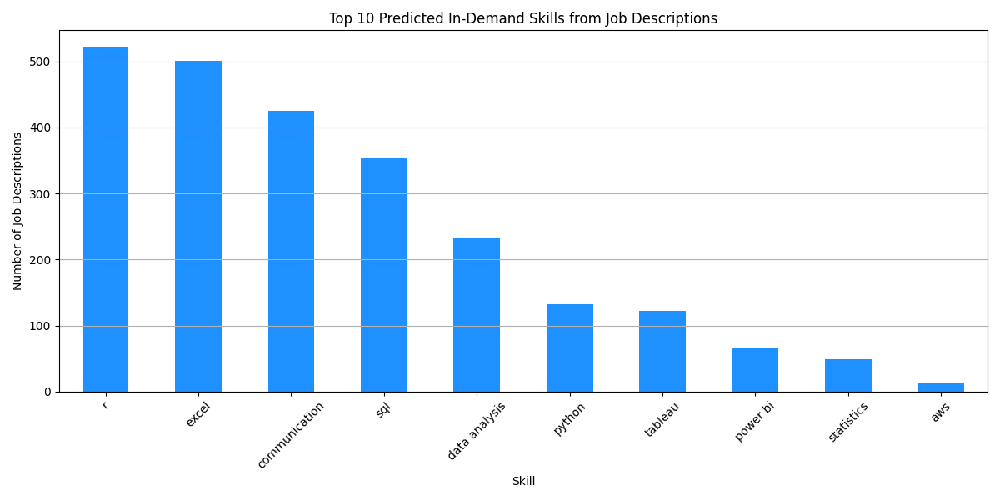
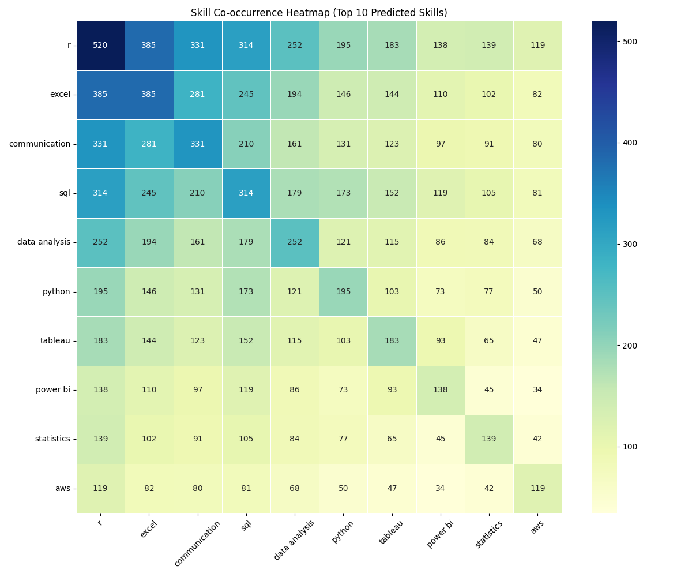
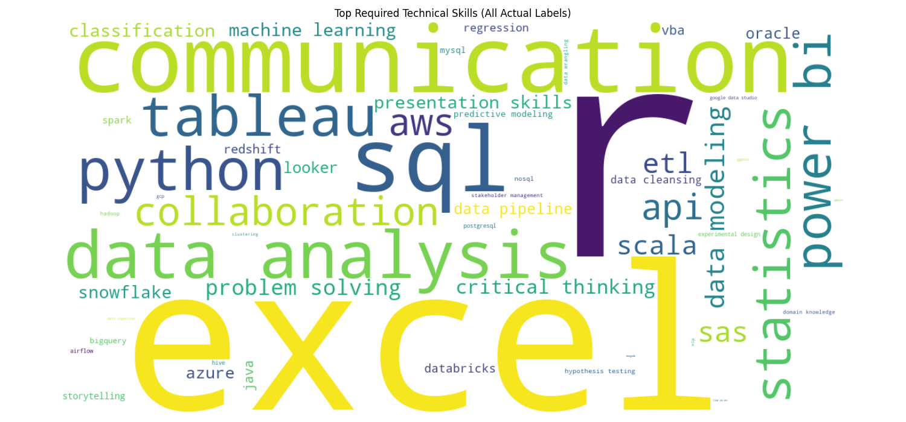

# 🧠 Job Skill Analyzer

A powerful multi-label classification project that analyzes job descriptions to detect **in-demand skills** using **Natural Language Processing (NLP)** and **Machine Learning**.  
Ideal for aspiring **Data Analysts**, **Data Scientists**, and **Data Engineers**.

[🔗 GitHub Repository](https://github.com/jayakishanMinnekanti/job-skill-analyzer.git)

---

## 📌 Project Overview

The **Job Skill Analyzer** is designed to:
- Clean and preprocess job descriptions
- Detect technical & soft skills using keyword matching
- Vectorize text using **TF-IDF**
- Train a **multi-label logistic regression** model
- Evaluate model performance
- Visualize skill trends with bar plots, heatmaps, and word clouds

---

## ⚙️ How It Works

### 🧼 1. Preprocessing
- Converts text to lowercase
- Removes HTML tags, URLs, punctuation, and extra whitespace

### 🏷️ 2. Label Generation
- Uses a curated `SKILL_LIST` (list of 50+ data skills)
- Generates binary labels for each skill (1 = present, 0 = not present)

### ✨ 3. Feature Extraction
- Applies `TfidfVectorizer` with:
  - 1000 maximum features
  - English stopwords removal

### 🔁 4. Model Training
- Uses `MultiOutputClassifier(LogisticRegression)`
- Handles multi-label classification across skills

### 📈 5. Evaluation
- Computes **precision**, **recall**, **f1-score** using `classification_report`

---

## 📊 Visualizations

### 📌 Top 10 Predicted Skills
Shows the most frequently predicted skills across job descriptions.



---

### 🔥 Skill Co-occurrence Heatmap
Highlights which skills commonly appear together in job listings.



---

### ☁️ Word Cloud of Labeled Skills
Visualizes the most frequently mentioned skills based on labels.



---

## 🧪 Sample Model Evaluation

Example from `classification_report`:

             precision    recall  f1-score   support

    python      0.91      0.94      0.93       130
    sql         0.85      0.89      0.87       115
    tableau     0.80      0.78      0.79        90
    aws         0.74      0.69      0.71        85
    power bi    0.82      0.75      0.78        78 ... (and more)

---

## 📍 Findings

- **Python**, **SQL**, and **Tableau** are the most demanded tools.
- Cloud platforms like **AWS** and **Azure** are increasingly relevant.
- **Soft skills** (communication, problem-solving) often co-occur with technical skills.

---

## 🔮 Future Enhancements

- Integrate deep learning models (e.g., BERT for contextual skill extraction)
- Expand labeled dataset for better generalization
- Deploy as a web app for resume/job description analysis
- Create a dashboard for real-time job skill trends

---

## 📦 Installation

```bash
# Step 1: Clone the repo
git clone https://github.com/jayakishanMinnekanti/job-skill-analyzer.git
cd job-skill-analyzer

# Step 2: Install dependencies
pip install -r requirements.txt

# Step 3: Run the analysis
python -m src.main
```
---

## 🗂️ Project Structure

```bash
job-skill-analyzer/
│
├── data/                         # 📁 Raw dataset (CSV format)
│   └── data.csv
│
├── images/                       # 📊 Generated plots and word clouds
│   ├── top_10_skills_barplot.png
│   ├── top_10_skill_cooccurrence.png
│   └── top_skills_wordcloud.png
│
├── models/                       # 💾 Trained ML model and TF-IDF vectorizer
│   ├── job_skill_model.pkl
│   └── tfidf.pkl
│
├── src/                          # 🧠 Source code
│   ├── main.py                   # 🔁 Core pipeline script
│   ├── utils.py                  # 🧹 Text cleaning and feature extraction
│   └── config.py                 # ⚙️ List of skills used for labeling
│
├── requirements.txt              # 📦 Project dependencies
├── LICENSE                       # 🪪 MIT License
└── README.md                     # 📘 Project overview and documentation
```

---
> 🔐 See our [Security Policy](./SECURITY.md) for how to report vulnerabilities.

## 🪪 License

> 📄 This project is licensed under the **MIT License**.  
> You are **free to use, modify, and distribute** this code — just remember to give **proper credit** to the original author.

🔗 [View Full License »](LICENSE)

---

## 🙌 Credits

| Author   | Jayakishan Minnekanti |
|----------|------------------------|
| Role     | Data Analyst           |
| Email    | [contact@jayakishan.com](mailto:contact@jayakishan.com) |
| LinkedIn | [linkedin.com/in/minnekanti](https://www.linkedin.com/in/minnekanti/) |

If you found this project helpful, please ⭐ the repo and connect with me on LinkedIn!
---